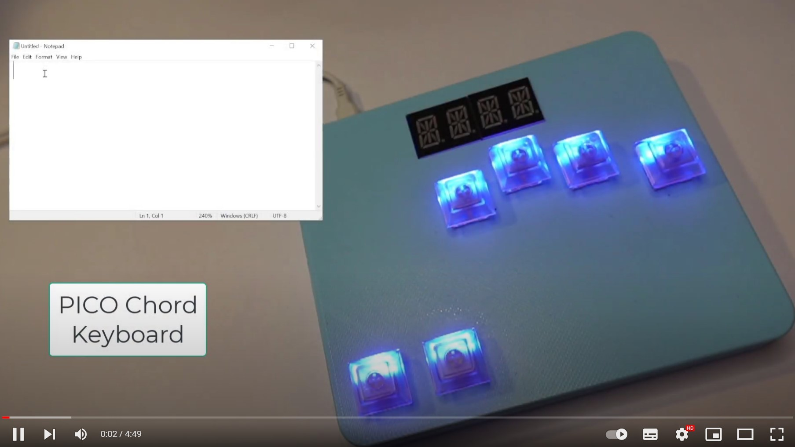

# PICO-Chord-keyboard

Designs and software for a chord keyboard controller.
## Video

To find out more about the device click on the image above to see a short video.

## Using the keyboard
The keyboard is implemented as a USB HID and can be used anywhere you would connect a USB keyboard. Characters are entered by pressing and releasing "chords". A full document and a keyboard map are available in the doc folder.
## History

The keyboard is based on the Cykey chord design by Cy Enfield which was used as the basis of the Microwriter and Microwriter AgendA devices developed by him and Chris Rainey. You can find out more about these devices [here](http://www.computinghistory.org.uk/det/5794/Microwriter-MW4/), [here](https://www.microsoft.com/buxtoncollection/detail.aspx?id=5) and [here](https://mindmachine.co.uk/book/A/Inp-Outp/Microwriter01.html). 

If you want to buy an official Microwriter keyboard you can get one [here](https://sites.google.com/site/cykeybellaire/home). 
## Hardware

You will need the following hardware items:

* Six keyswitches. The Kailh Mechanical Keyboard Switches work well. You can get them in “clicky” or “non-clicky” form. 
* Six transparent keycaps. 
* Six Neokey Socket Breakouts from AdaFruit. These have a built-in neopixel that is used to show which keys to press for each letter. If you don’t want to use this part of the program you can just wire up the keys directly. 
* A four character alphanumeric display with an HT16K33 backpack. Search for "ht16k33 14 segment led". Make sure that you get the 14-segment device as this can display text.
* A Raspberry Pi PICO
* A micro-USB cable to link the PICO to the host
* Connecting wire (search for "30 AWG wire wrap") which needs a wire wrap tool (search for "wire wrap tool").
* A box. There is a 3D printable design, or you can put your keyboard in any box you fancy.
* Screws. You'll need some screws sized M2 4mm in length to fix things to the case (search for "laptop screws")
## Program installation
You must install Python 7 on your PICO device. Then copy the contents of the lib folder in this repository into the lib folder on your PICO. Finally copy the code.py file into root folder of your PICO.
## Program development
You can use the Pymaker plugin for Visual Studio Code to develop this software. To save and run the program, copy the code.py file from this repository onto the root folder of your PICO. This should cause the program to restart.
## Case designs
There are case designs in the case folder. There is also a macro for FreeCAD which you can modify to produce cases with different key positions. 

Have Fun!
Rob Miles January 2022
